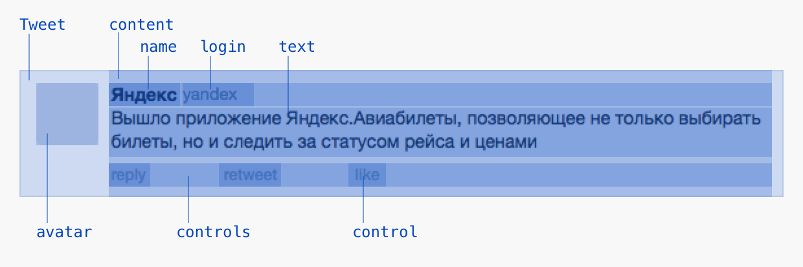

# 1. Введение в Beast

Beast — это фреймворк для построения веб-интерфейсов. В отличие от простой HTML-страницы, Beast разделяет данные и верстку. Данные — это изменяемые части страницы (названия, тексты, картинки, модификаторы). Верстка — это шаблон страницы, в которую вставляются данные.

Разберём как это работает на примере страницы, на которой выводится твит.

```html
<!-- подключение фреймворка -->
<script type="text/javascript" src="beast.js"></script>
<!-- подключение шаблона -->
<script type="text/javascript" src="tweet.js"></script>
...
<!-- описание данных -->
<script type="bml">
    <Tweet>
        <author>Яндекс</author>
        <login>@yandex</login>
        <text>Встречайте Yandex Sans!</text>
    </Tweet>
</script>
```

В `tweet.js` находится шаблон верстки, в который вставляются данные:

```js
Beast.decl('Tweet', {
    expand: function(){
        this.append(
            <avatar/>,
            <content>
                <author>
                    {this.get('name')}
                    {this.get('login')}
                </author>
                {this.get('text')}
                <controls>
                    <control Type="reply"/>
                    <control Type="retweet"/>
                </controls>
            </content>
        )
    }
})
```




Шаблон конвертируется в HTML по [БЭМ-методологии](https://ru.bem.info/method/key-concepts/).

```html
<div class="tweet">
    <div class="tweet__avatar"></div>
    <div class="tweet__content">
        <div class="tweet__author">
            <div class="tweet__name">Яндекс</div>
            <div class="tweet__login">@yandex</div>
        </div>
        <div class="tweet__text">Встречайте Yandex Sans!</div>
        <div class="tweet__controls">
            <div class="tweet__control tweet__control_type_reply"></div>
            <div class="tweet__control tweet__control_type_retweet"></div>
        </div>
    </div>
</div>
```

Разделяя данные и верстку можно легко изменять внешний вид компонентов сразу всех на всех страницах проекта. Например, чтобы добавить кнопку `like` в каждый твит, нужно лишь дописать шаблон:

```js
Beast.decl('Tweet', {
    expand: function(){
        this.append(
            ...
            <content>
                <author>...</author>
                <text>...</text>
                <controls>
                    ...
                    <control Type="like"/>
                </controls>
            </content>
        )
    }
})
```

Если бы мы использовали простой HTML, то на странице со списом твитов пришлось бы вставлять `<div class="tweet__control tweet__control_type_like"></div>` в каждый твит.

В следующих уроках мы научимся описывать данные в BML-разметке, писать шаблоны и работать с событиями.
