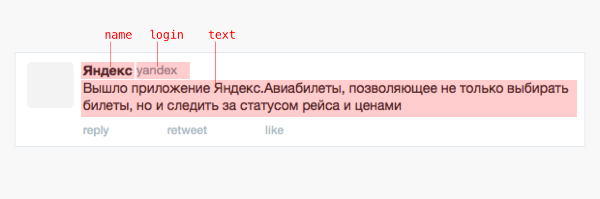
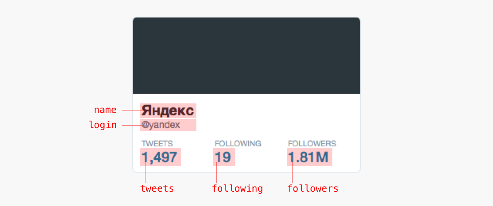

# 2. Разметка

BML-разметка похожа на HTML, но им не является. BML — это способ описания структуры данных для шаблона, который фомирует окончательное HTML-дерево по БЭМ-методологии.

В BML-разметке нужно оставлять только переменные данные. В примере с твитом, это `author`, `login` и `text`.



Разметка — это описание данных для блока.

Блок — это независимый компонент интерфейса. Блоки можно перемещать в пределах одной страницы, разных страниц или проектов. Независимая реализация блока позволяет изменять его положение на странице и обеспечивает корректную работу и внешний вид.

Более подробно о блоках можно прочитать в [методологии БЭМ](https://ru.bem.info/method/key-concepts/).

Чтобы отличать в разметке блоки от элементов, блоки называются с большой буквы, а элементы — с маленькой. Вот так выгдялит разметка для твита:

```html
<script type="bml">
    <Tweet>
        <author>Мистер Икс</author>
        <login>donateater</login>
        <text>Радиация убивает только тех, кто в нее верит.</text>
    </Tweet>
</script>
```

Элементы могут быть вложенными, а также содержать другие блоки. Элементы являются частью блока, которая не может использоваться в отрыве от него.

Например, компоненты `item` в блоке `Stream` вне контекста блока не используется, а значит являются элементами.

```html
<script type="bml">
    <Stream>
        <item>
            <author>Мистер Икс</author>
            <login>donateater</login>
            <text>Попытка — первый шаг к провалу.</text>
        </item>
        <item>
            <author>Мистер Икс</author>
            <login>donateater</login>
            <text>В моем доме мы подчиняемся только законам термодинамики.</text>
        </item>
        <item>...</item>
        ...
    </Stream>
</script>
```

## Задание

По аналогии с Tweet, cоздайте BML-разметку своего профиля твиттера.



Откройте файл `lessons/2/task.html` и допишите разметку. Если всё сделаете правильно, ваш профиль появится на [этой странице](http://localhost:3052/lessons/2/task.html).
