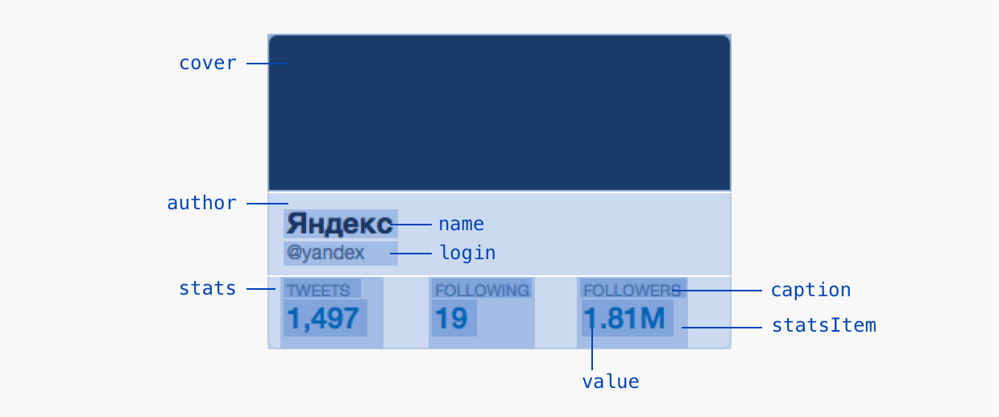

# 3. Шаблоны

Мы научились создавать разметку. Теперь научимся забирать из неё данные и встраивать в шаблон.

Итак, у нас есть разметка блока `Tweet`:

```html
<script type="bml">
    <Tweet>
        <name>Мистер Икс</name>
        <login>donateater</login>
        <text>Я тут считал налоги и случайно доказал, что бога нет.</text>
    </Tweet>
</script>
```

Нам нужно получить такой HTML-код после шаблона:

```html
<div class="tweet">
    <div class="tweet__avatar"></div>
    <div class="tweet__content">
        <div class="tweet__author">
            <div class="tweet__name">Мистер Икс</div>
            <div class="tweet__login">@donateater</div>
        </div>
        <div class="tweet__text">
            Я тут считал налоги и случайно доказал, что бога нет.
        </div>
        <div class="tweet__controls">
            <div class="tweet__control tweet__control_type_reply"></div>
            <div class="tweet__control tweet__control_type_retweet"></div>
            <div class="tweet__control tweet__control_type_like"></div>
        </div>
    </div>
</div>
```

Если не создавать правила развертки разметки данных, то Beast скомпилирует такой HTML:

```html
<div class="tweet">
    <div class="tweet__name">Мистер Икс</div>
    <div class="tweet__login">donateater</div>
    <div class="tweet__text">
        Я тут считал налоги и случайно доказал, что бога нет.
    </div>
</div>
```

Чтобы создать правило, нужно добавить в файле шаблона декларацию. Для этого есть метод `Beast.decl(selector, options)`. `selector` — это CSS класс блока или элемента, `options` — описание правил.

```js
// Декларация для Tweet
Beast.decl('Tweet', {
    expand: function(){
        // правила развертки
    }
})
```

Для изменения структуры есть метод `.append()`, который позволяет заменить элементы в текущем компоненте. Добавим нужный нам шаблон твита:

```js
Beast.decl('Tweet', {
    expand: function(){
        this.append(
            <avatar/>,
            <content>
                <author>
                    <name/>
                    <login/>
                </author>
                <text/>
            </content>
        )
    }
})
```

> Тут есть особенность. Теги прекомпилируются в Javascript-код, в котором нужны запятые, чтобы не ломался синтаксис Javascript-а:
>
> ```
> Beast.decl('Tweet', {
>     expand: function(){
>         this.append(
>             Beast.node(...),
>             Beast.node(...)
>         )
>     }
> })
> ```
>
> Запятые нужно ставить только для первого уровня вложенности. Во вложенных тегах запятые не нужны.

В итоге у нас получился такой HTML-код:

```html
<div class="tweet">
    <div class="tweet__avatar"></div>
    <div class="tweet__content">
        <div class="tweet__author">
            <div class="tweet__name"></div>
            <div class="tweet__login"></div>
        </div>
        <div class="tweet__text"></div>
    </div>
</div>
```

Если вызвать метод `.append()` несколько раз подряд, то каждый будет добавлять новые элементы в конец развертки. В случае, когда необходимо добавить элемент в начало развертки, существует метод `.prepend()`.

Осталось подставить данные. Для получения данных есть метод `.get()`, который возвращает массив найденых элементов:

```js
Beast.decl('Tweet', {
    expand: function(){
        this.get() // [<name>Мистер Икс</name>, <login>@donateater</login>, ...]
        this.get('name') // [<name>Мистер Икс</name>]

        this.append(...)
    }
})
```

> Данные в разметке могут иметь случайный порядок. Поэтому, если вам важен порядок входных данных в блок, то всегда с помощью метода `.get()` определяйте этот порядок.

Теперь подставим элементы в шаблон. Для этого удобно использовать фигурные скобки, в которых выполняется Javascript:

```js
Beast.decl('Tweet', {
    expand: function(){
        this.append(
            <avatar/>,
            <content>
                <author>
                    {this.get('name')}
                    {this.get('login')}
                </author>
                {this.get('text')}
            </content>
        )
    }
})
```

Метод `.get()` поддерживает несколько входящих значений и получает их по порядку. Поэтому получение элементов `name` и `login` из предыдущего примера можно сократить:

```js
Beast.decl('Tweet', {
    expand: function(){
        this.append(
            <avatar/>,
            <content>
                <author>
                    {this.get('name', 'login')}
                </author>
                {this.get('text')}
            </content>
        )
    }
})
```

Добавим `@` к логину. Для этого создадим декларацию для элемента:

```js
Beast.decl('Tweet__login', {
    expand: function(){
        this.append('@' + this.text())
    }
})
```

Мы использовали метод `.text()`. Он возвращает текстовое содержимое ноды.

> Другая важная особенность — при использовании `.get()`, `.append()` элементы не дублируются. Вот такой код вызовет ошибку:

```js
Beast.decl('tweet', {
    expand: function(){
        this.append(
            <exampleOne>
              {this.get('login')}
            </exampleOne>,
            <exampleTwo>
              {this.get('login')}
            </exampleTwo>
        )
    }
})
```
Чтобы исправить ситуацию, нужно клонировать элемент. Для этого существует метод `.clone()`:

```js
Beast.decl('tweet', {
    expand: function(){
        this.append(
            <exampleOne>
              {this.get('login')}
            </exampleOne>,
            <exampleTwo>
              {this.get('login')[0].clone()}
            </exampleTwo>
        )
    }
})
```

Теперь ошибки нет и у нас появилось два элемента `<login/>`:
```html
<div class="tweet">
    <div class="tweet__exampleone"></div>
        <div class="tweet__login">donateater</div>
    <div class="tweet__exampletwo">
        <div class="tweet__login">donateater</div>
    </div>
})
```

По умолчанию Beast преобразует ноды в теги `div`. Иногда необходимо использование ссылок `a`, полей `input` или картинок `img`, и в таком случае, есть два способа.

Декларативный способ позвляет назначить тег элемента, модификаторы и параметры по умолчанию, а также прочие атрибуты перед разверткой.

```js
Beast.decl('Tweet__login', {
    tag: 'a',
    domAttr: {
        href: 'http://yandex.ru'
    },
    expand: function(){
        this.append('@' + this.text())
    }
})
```

Второй способ позволяет сделать тоже самое, но в развертке блока.

```js
Beast.decl('Tweet__login', {
    expand: function(){
        this.tag('a')
        this.domAttr({
            href: 'http://yandex.ru'
        })
        this.append('@' + this.text())
    }
})
```

Например, установить фон у элемента можно использовав метод `domAttr`:

```js
Beast
.decl('Profile__cover', {
    expand: function(){
        this.domAttr({
            style: 'background-image: url(' + this.text() + ')'
        })
        this.empty()
    }
})
```

Однако, для работы с CSS-атрибутами существует специальный метод `.css()`, который позволяет получить или назначить CSS-правило.

```js
Beast
.decl('Profile__cover', {
    expand: function(){
        this.css('background-image', 'url(' + this.text() + ')')
        this.empty()
    }
})
```

Все эти способы рассматривают переопределение атрибутов в перед разверткой элемента. В случае, когда необходимо получить или переопределить атрибут ноды на уже сформированной странице, следует использовать метод `.domNode()`.

Например, в этом коде при клике на кнопку, значение из заполненного поля отобразится в консоли.

```js
.decl('NewTweet__button', {
    on: {
        click: function(){
            var text = this.get('../field')[0].domNode().value
            console.log(text)
        }
    }
})
```

## Задание

Создайте шаблон для BML-разметки своего профиля твиттера, используя схему:



Логин должен быть ссылкой, а в обложке установлена картинка.

В папке `lessons/3` вы найдете файл с данными и папку `blocks` с шаблонами. На [этой странице](http://localhost:3052/lessons/3/task.html) должен появиться свёрстанный профиль.
