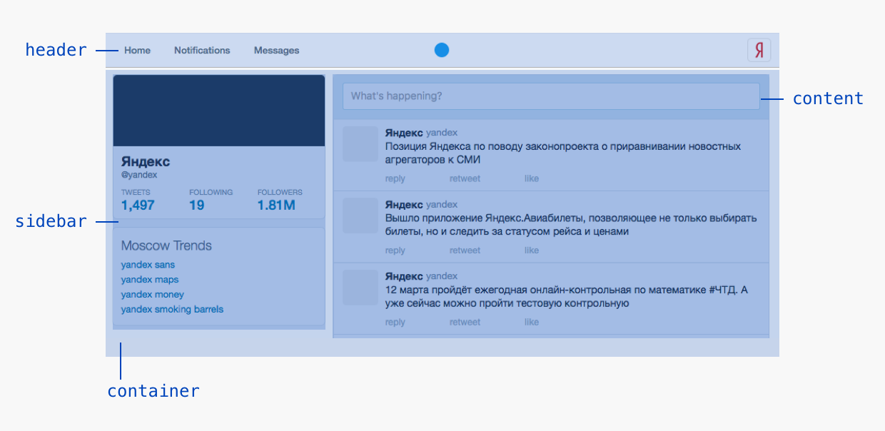

# 6. Зверство

В этом уроке мы разберемся, как применять Beast на примере создания страницы твиттера по шагам.

Начнём с данных. Страница состоит из профиля (аватарка, статистика, имя, логин), списка твитов, трендов.


Запишем всё это в BML:

```html
<script type="text/bml">
    <Twitter>
        <profile>
            <name>Яндекс</name>
            <login>yandex</login>
            <avatar>avatar.png</avatar>
            <tweets>10</tweets>
            <followers>10</followers>
            <following>10</following>
        </profile>
        <stream>
            <item>
                <name>Yandex</name>
                <login>yandex</login>
                <text>Welcome Yandex Sans!</text>
            </item>
            ...
        </stream>
        <trends>
            <item>yandex sans</item>
            <item>yandex maps</item>
            <item>yandex money</item>
            <item>yandex smoking barrels</item>
        </trends>
    </Twitter>
</script>
```

Теперь займёмся версткой. Разобьем всю страницу на блоки.


Начнём описывать блоки. Вот элементы блока `<Twitter>`:



Напишем декларацию:

```js
Beast
.decl('Twitter', {
    expand: function(){
        this.append(
            <header/>,
            <container>
                <sidebar/>
                <content/>
            </container>
        )
    }
})
```

Внутри элемента `<header>` будет находиться блок `<Header>`. Опишем его:

```js
Beast
.decl('Header', {
    expand: function(){
        this.append(
            <container>
                <tabs>
                    <tab>Home</tab>
                    <tab>Notifications</tab>
                    <tab>Messages</tab>
                </tabs>
                <logo/>
                {this.get('avatar')}
            </container>
        )
    }
})
// BML-разметка будет выглядеть так:
// <Header>
//     <avatar>avatar.png</avatar>
// </Header>
```

Чтобы вставить блок, воспользуется методом `.implementWith()`. Этот метод позволяет назначить элементу поведение блока. Элементы внутри станут элементами блока `<Header>`.

```js
Beast
.decl('Twitter', {
    expand: function(){
        this.append(
            <header>
                <avatar>avatar.png</avatar>
            </header>,
            ...
        )
    }
})
.decl('Twitter__header', {
    expand: function(){
        // this.get() добавляет в блок элементы внутри header
        this.implementWith(<Header>{this.get()}</Header>)
    }
})
```

В итоге, это скомпилируется в такой HTML:

```html
<div class="twitter">
    <div class="twitter__header header">
        <div class="header__avatar">avatar.png</div>
        ...
    </div>
</div>
```

Отлично! Мы передали данные со страницы через `<Twitter>` в `<Header>`. Осталось превратить адрес картинки в картинку.

```js
Beast
.decl('Header', {...})
.decl('Header__avatar', {
    expand: function(){
        this.css('background-image', 'url("' + this.text() + '")')
        this.empty()
    }
})
```

## Задание

Нужно дописать все остальные декларации. Всё, на чём мы остановились в уроке находится в папке `lessons/6`.

### Часть 1. Собираем сайдбар

Мы уже декларировали `<Profile>` и видели как сделан `<Trends>`.

Интегрируем их в сайдбар. У него должны быть такие элементы:


Вам нужно превратить их в блоки `<Profile>` и `<Trends>`, как описано выше.

В `lessons/6/sidebar.html` описаны данные для сайдбара. Напишите шаблон сайдбара и проверьте всё ли получилось на [этой странице](http://localhost:3052/lessons/6/sidebar.html).

### Часть 2. Собираем контент

Начнём с самых простых блоков, которые не включают в себя другие блоки — `<NewTweet>` и `<Tweet>`.

Вот элементы блока `<NewTweet>`:


Напишите шаблон для блока и проверьте что получилось на [этой странице](http://localhost:3052/lessons/6/newtweet.html).

Вот элементы блока `<Tweet>`:


Напишите шаблон для блока и проверьте что получилось на [этой странице](http://localhost:3052/lessons/6/tweet.html).

Теперь соберём блок `<Stream>`. Вот его элементы:


Напишите его шаблон — имплементируйте `<item>` как `<Tweet>`. В результате получится лента на — [этой странице](http://localhost:3052/lessons/6/stream.html).

Теперь соберём `<Content>`. Вот его элементы:


Напишите шаблон по аналогии. Проверьте на [этой странице](http://localhost:3052/lessons/6/content.html).

### Часть 3. Собираем всё вместе

Осталось только вставить сайдбар и контент в `<Twitter>`.

Сделайте это. Вот элементы твиттера:


В итоге вы полностью сверстаете твиттер на [этой странице](http://localhost:3052/lessons/6/twitter.html).
