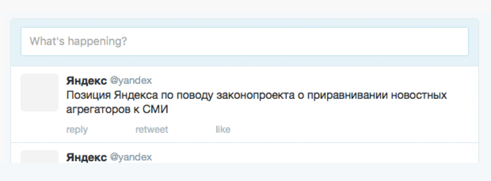
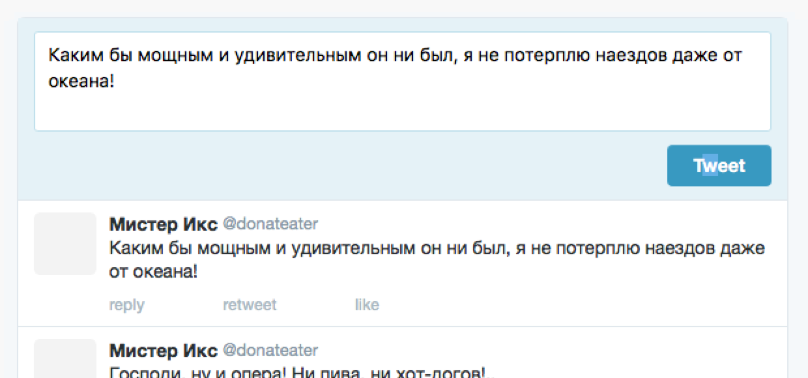

# 7. События

Beast также помогает связывать блоки и элементы между собой событиями.

Например, мы хотим, чтобы по фокусу в текст твита поле расширялось и появлялясь кнопка:



Фактически в блоке `NewTweet` меняется состояние — схлопнут/расхлопнут. Добавим в декларацию обработку события `focus` элемента `<field/>`:

```js
Beast
.decl('NewTweet', {
    mod: {
        State: 'collapsed' // состояние: схлопнут
    }
    expand: function(){
        this.append(
            <field/>,
            <button/>
        )
    }
})
.decl('NewTweet__field', {
    on: { // В `on` перечисляем события, которые хотим обработать
        focus: function(){
            this.parentBlock().mod('State', 'expanded')
        }
    },
    ...
})
```

Отлично. По клику в поле срабатывает событие `focus`, поле расширяется и появляется кнопка. Вид состояний описан в стилях:

```less
.newtweet {
    &_state {
        &_collapsed {
            .newtweet__field {
                height: 36px;
            }

            .newtweet__button {
                display: none;
            }
        }

        &_expanded {
            .newtweet__field {
                height: 72px;
            }
        }
    }
}
```

Теперь сделаем так, чтобы по кнопке `Tweet` введенный текст добавлялся ленту твитов.

Для начала достанем текст из поля ввода по клику на `<button/>`:

```js
Beast.decl('NewTweet__button', {
    on: {
        click: function(){
            var field = this.get('../field')[0]
            var value = field.domNode().value
        }
    }
})
```

Отлично, теперь нам нужно отправить событие `new-tweet-posted` в блок `Stream`. Отправлять события в другие блоки можно через события окна браузера — объекта `window`. Для этого воспользуемся методом `triggerWin`:

```js
Beast.decl('NewTweet__button', {
    on: {
        click: function(){
            var field = this.get('../field')[0]
            var text = field.domNode().value

            this.triggerWin('new-tweet-posted', text)
        }
    }
})
```

Теперь каждый блок или элемент может подписаться на событие `NewTweet:new-tweet-posted` и обработать его.

Подпишем `<Stream>` на обработку событий. Выглядит это так:

```js
Beast.decl('Stream', {
    onWin: {
        'NewTweet:new-tweet-posted': function(event){
            var text = event.detail
            this.prepend(
                <item>
                    <name>Мистер Икс</name>
                    <login>donateater</login>
                    <text>{text}</text>
                </item>
            )
        }
    }
})
```

Готово. Твит добавился:



Осталось вернуть блок `<NewTweet>` в исходное состояние. Сейчас он раскрыт и в нём остался текст.

Вернём состояние блока в `collapsed`:

```js
Beast.decl('NewTweet__button', {
    on: {
        click: function(){
            var field = this.get('../field')[0]
            var text = field.domNode().value

            this.triggerWin('post-new-tweet', text)

            this.parentBlock().mod('State', 'collapsed')
        }
    }
})
```

Мы также можем подписаться на изменения модификаторов блока. Подпишемся на изменения значения `State` в значение `collapsed` и почистим текст блока:

```js
Beast.decl('NewTweet', {
    onMod: {
        state: {
            collapsed: function(){
                var field = this.get('field')[0]
                field.domNode().value = ''
            }
        }
    }
})
```

Готово. Теперь текст стирается и блок становится таким, каким был в начале.

## Задание

На [странице](/lessons/7/task.html) вы найдёте рекламный блок `<Ad>`.

Допишите декларацию блока так, чтобы по крестику текущая реклама заменялась на другую, пока не кончится.
